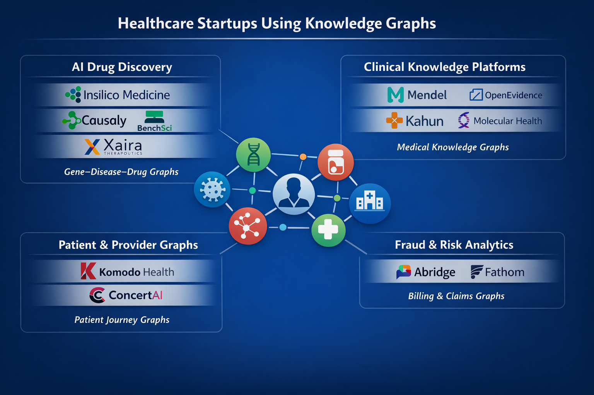

# Case Studies

## Startup Companies

## ChatGPT Said - GPT-5.2 Thinking

Below is a company-by-company breakdown from your infographic, focused on **how graph technology (knowledge graphs / graph-native models / hypergraphs) creates competitive advantage**.

Important note

For several companies in the graphic, I could **not** find public, technical documentation that they use a knowledge graph (as opposed to “linked data” in a warehouse). For those, I’m explicit about what is and isn’t evidenced.

---

## Insilico Medicine

### Documented evidence they use a knowledge graph

Insilico’s PandaOmics documentation describes a **knowledge graph** as an “enormous network linking Genes, Diseases, Chemicals, and Biological Processes,” with relationships supported by references to original publications. ([insilico.com][1])

### How graphs create competitive advantage

* Evidence-backed target discovery at scale
  Their KG acts as an “evidence backbone” that connects omics signals to known biology (gene–disease–process–compound), letting scientists move from “differential expression” to “mechanistic plausibility” faster than purely embedding-based literature search.

* Explainability and provenance (why a target)
  Because edges are tied to publications, the system can show *why* a gene is relevant, not just that it co-occurs in text. That’s a major advantage in drug discovery where decisions must be defended scientifically.

* Faster iteration on hypotheses
  A graph structure supports traversal-style questions (upstream/downstream biology, related pathways, known modulators) that are cumbersome in purely tabular feature stores.

---

## Causaly

### Documented evidence they use a knowledge graph

Causaly explicitly presents a “high-precision biomedical knowledge graph,” and a dedicated KG page describing it. ([causaly.com][2])

### How graphs create competitive advantage

* Causal, directional relationships (not just co-occurrence)
  Their positioning emphasizes differentiating causality vs co-occurrence and “directional relationships,” which is exactly where KG semantics outperform generic RAG over papers. ([causaly.com][2])

* Competitive intelligence and “pipeline graph” views
  A KG enables linking targets → mechanisms → companies → trials → outcomes, supporting early “go/no-go” decisions and reducing redundant research.

* Verifiability
  A KG can keep every claim anchored to an extracted evidence object (paper section, figure, supplemental table), reducing hallucination risk in scientific workflows.

---

## BenchSci

### Documented evidence they use a knowledge graph and graph database

BenchSci publicly states their platform core is a **Biological Evidence Knowledge Graph (BEKG)** with hundreds of millions of entities and relationships. ([BenchSci][3])
Neo4j also published a customer story describing BenchSci using **Neo4j** to build a graph-native model. ([Neo4j Graph Intelligence Platform][4])

### How graphs create competitive advantage

* Evidence-first biomedical reasoning
  Their BEKG is positioned as an “evidence backbone,” linking claims directly to traceable experimental sources, which improves trust and reduces “LLM hallucination” risk in R&D. ([BenchSci][3])

* Multimodal extraction at scale
  BenchSci describes extracting information not only from text but also figures/supplemental files (then structuring into graph form). The KG becomes the normalized substrate for search and reasoning.

* Graph-native querying for de-risking discovery
  Graph traversal naturally supports questions like “show all evidence paths linking target X to phenotype Y under model Z,” which is hard to do reliably with keyword search alone.

---

## Mendel

### Documented evidence they use a knowledge graph (hypergraph)

Google Cloud’s writeup states Mendel “leverages a clinical hypergraph,” described as a multi-dimensional knowledge graph used to represent medical information and relationships. ([Google Cloud][5])

### How graphs create competitive advantage

* Cohort building and trial matching via relationship structure
  A clinical hypergraph supports multi-entity, multi-hop constraints (patient–condition–lab–medication–timeline), enabling faster “find me patients like this” and “trial eligibility” workflows than SQL alone.

* Consistency and explainability of extracted phenotypes
  Using a curated representation layer (hypergraph) helps enforce stable semantics across messy EHR sources, reducing brittleness in downstream AI outputs.

* Better “clinical logic” alignment
  Graph representations can encode clinical abstractions (problem lists, temporal relations, care episodes), enabling clinician-like reasoning without hardcoding everything as rules.

---

## Kahun

### Documented evidence they use a knowledge graph

EU CORDIS reporting states Kahun’s AI “uses the knowledge graph to generate a differential diagnosis.” ([CORDIS][6])
A CORDIS project page also states Kahun’s engine “generates and infers from a huge knowledge graph” linking diseases, findings, complications, risk factors, etc. ([CORDIS][7])
Their investor deck claims they are “powered by the only evidence-based knowledge graph for healthcare.” (Marketing claim, but still an explicit KG assertion.) ([Goldfarb Gross Seligman][8])

### How graphs create competitive advantage

* Differential diagnosis as graph inference
  Symptom/finding → disease edges (with risk factors, complications, tests) let Kahun compute candidate diagnoses and next-best questions/tests through graph traversal/inference rather than generic text completion.

* Evidence grounding in clinical workflows
  Knowledge-graph-backed reasoning is easier to audit than opaque end-to-end models, a key advantage for decision support where accountability matters.

* Fast updates as medical knowledge changes
  Updating the graph (entities/edges/weights) can update clinical outputs without retraining large models.

---

## Xaira Therapeutics

### What I could verify publicly

Xaira’s public website describes AI-driven drug discovery but does **not** publicly document a knowledge-graph architecture. ([xaira.com][9])

### What I cannot claim

I do not have a primary, public technical source stating Xaira uses knowledge graphs specifically (as opposed to general AI/ML). So I can’t describe their KG implementation as “documented.”

### Most likely graph advantage (clearly marked as inference)

If Xaira is operating like many frontier AI-bio platforms, a KG would typically unify: targets, pathways, disease models, patient stratification, assays, and trial evidence into a single mechanistic substrate. That would enable multi-hop biological reasoning and provenance tracking. (Inference; not confirmed by a public technical reference.)

---

## OpenEvidence

### What I could verify publicly

OpenEvidence publicly describes a physician-facing evidence platform with large content partnerships and usage claims. ([openevidence.com][10])

### What I cannot claim

I did not find a public, technical statement that OpenEvidence uses a **knowledge graph** internally. So I cannot credibly describe “how their KG works” as documented.

### If you want this one in the “graph proven” set

We’d need a source like: product docs, an engineering blog, a paper, or a talk explicitly describing a KG/ontology layer.

---

## Molecular Health

### What I could verify publicly

In the browsing I just ran, I did not find a clear primary source asserting Molecular Health uses a knowledge graph.

### What I cannot claim

No documented KG evidence found in this pass, so I can’t responsibly describe their graph implementation.

---

## Komodo Health

### What I could verify publicly

Komodo publicly describes a “Healthcare Map” and patient journey analytics, but I did not find a primary technical source stating they use a **knowledge graph/graph database** rather than an integrated longitudinal dataset in a warehouse/lakehouse. ([Komodo Health][11])

### What I cannot claim

I cannot claim Komodo uses graph technology (Neo4j/TigerGraph/KG) based on the sources above.

### Where graph tech could matter (inference)

Patient journey analytics is a natural fit for graphs (patient → provider → encounter → dx → rx → outcome), enabling fast cohort exploration and network analytics. But that’s a modeling argument, not proof.

---

## ConcertAI

### What I could verify publicly

I found a HIMSS/HealthcareITNews video summary quoting ConcertAI leadership discussing anticipating regulatory AI logic “using knowledge graphs.” ([Healthcare IT News][12])

### What that does and does not prove

* It does show **ConcertAI leadership explicitly talks about knowledge graphs** in their context.
* It does **not** fully prove that ConcertAI’s commercial platform is built on a KG (it could be thought leadership, partial components, or specific products).

### Plausible competitive advantage (partly inference)

If ConcertAI operationalizes KGs for regulatory and clinical trial workflows, the advantage would be:

* Evidence traceability for submissions (claim → evidence → dataset lineage)
* Semantic interoperability across EHR/claims/genomics vocabularies
* Multi-hop trial design queries (population → biomarkers → therapy lines → outcomes)

But: I’d want a more direct product/architecture reference to call this “definite.”

---

## Abridge

### What I could verify publicly

Abridge’s public pages emphasize ambient clinical documentation and outcomes, but I did not find a primary technical reference that they use knowledge graphs. ([abridge.com][13])

### What I cannot claim

No documented KG evidence found here, so I can’t describe KG-based advantage as fact.

### Graph-shaped advantage that is common in this space (inference)

Many clinical documentation systems benefit from an ontology/KG layer for:

* concept normalization (SNOMED/ICD/RxNorm)
* linking problems ↔ meds ↔ labs ↔ plan elements
* grounding “contextual reasoning” across encounters

But again, inference.

---

## Fathom

### What I could verify publicly

Fathom publicly describes autonomous medical coding AI, but I did not find a primary technical source that they use a knowledge graph/graph database. ([fathomhealth.com][14])

### What I cannot claim

No documented KG evidence found, so I can’t claim graph tech is core.

### Where graph tech could be a differentiator (inference)

In coding, graphs can represent constraints like:

* procedure ↔ diagnosis compatibility
* code co-occurrence patterns across providers/facilities
* denial/fraud networks across entities

But this is not confirmed for Fathom from public sources.

---

## What this means for your infographic

Right now, based on documented technical evidence in sources I located:

Definite knowledge graph users (strong evidence)

* Insilico Medicine ([insilico.com][1])
* Causaly ([causaly.com][2])
* BenchSci ([BenchSci][3])
* Mendel ([Google Cloud][5])
* Kahun ([CORDIS][6])

Mentioned/uncertain from public sources found in this pass

* ConcertAI (KGs discussed, product implementation not proven here) ([Healthcare IT News][12])
* Xaira, OpenEvidence, Molecular Health, Komodo, Abridge, Fathom (no solid public KG proof found in this pass) ([xaira.com][9])

---

If you want, I can do the next step in a way that will make your “graph-proven healthcare landscape map” bulletproof:

* For each “uncertain” company, I’ll either find a primary reference that explicitly states KG/graph DB usage, or I’ll recommend removing it from the “concrete evidence” infographic and replacing it with companies that do publish KG proofs (for example: **Corti (if KG-backed triage knowledge), Sophron (biomed KG), BenevolentAI-style firms, etc.** depending on what’s verifiable today).

[1]: https://insilico.com/pandaomics/help/knowledge_graph?utm_source=chatgpt.com "Knowledge Graph | PandaOmics"
[2]: https://www.causaly.com/ai-platform/knowledge-graph?utm_source=chatgpt.com "Knowledge Graph"
[3]: https://www.benchsci.com/?utm_source=chatgpt.com "BenchSci: Reimagining Research"
[4]: https://neo4j.com/customer-stories/benchsci/?utm_source=chatgpt.com "BenchSci Decodes Disease Biology with ..."
[5]: https://cloud.google.com/transform/gen-ai-medical-records-solutions-llms-mendel?utm_source=chatgpt.com "Can gen AI bring order to medical records? This startup is ..."
[6]: https://cordis.europa.eu/article/id/442686-taking-smart-diagnostic-support-tools-to-the-next-level?utm_source=chatgpt.com "Taking smart diagnostic support tools to the next level - CORDIS"
[7]: https://cordis.europa.eu/project/id/961253/reporting?utm_source=chatgpt.com "Kahun - an interactive medical knowledge base, for ... - CORDIS"
[8]: https://www.goldfarb.com/pdf2/Kahun%20Investor%20Deck-%20March%202024.pdf?utm_source=chatgpt.com "Kahun Investor Deck- March 2024"
[9]: https://www.xaira.com/?utm_source=chatgpt.com "Xaira Therapeutics"
[10]: https://www.openevidence.com/about?utm_source=chatgpt.com "About"
[11]: https://www.komodohealth.com/?utm_source=chatgpt.com "Komodo Health: Comprehensive Patient Journey Data"
[12]: https://www.healthcareitnews.com/video/tips-submissions-federal-agency-ai-models?utm_source=chatgpt.com "Tips for submissions to federal agency AI models"
[13]: https://www.abridge.com/?utm_source=chatgpt.com "Abridge: Generative AI for Clinical Conversations"
[14]: https://fathomhealth.com/?utm_source=chatgpt.com "Fathom - Medical coding automation powered by AI"
