# MicroSims for Modeling Healthcare

This book includes **127 interactive MicroSims** — self-contained, browser-based visualizations you can explore directly. Click any thumbnail to open the MicroSim.

## Validated MicroSims

27 MicroSims have been implemented from their TODO specifications and score 100/100 on the project's completeness rubric. Each was checked in a browser at 400, 800, and 1200 px for JavaScript errors, horizontal overflow, and clipped controls, and each carries a lesson plan with a stated learning objective, Dublin Core metadata, and a preview image.

| MicroSim | Validated | Quality Score |
|---|---|---|
| [Behavioral Health Screening Graph Model](behavioral-health-screening-graph-model/index.md) | 2026-09-07 | 100/100 |
| [Graph Algorithm Family Map](graph-algorithm-family-map/index.md) | 2026-09-07 | 100/100 |
| [Graph Sharding Partition Explorer](graph-sharding-partition-explorer/index.md) | 2026-09-07 | 100/100 |
| [Healthcare Graph Anatomy Explorer](healthcare-graph-anatomy-explorer/index.md) | 2026-09-07 | 100/100 |
| [Patient Demographics and SDOH Profile](patient-demographics-sdoh-profile/index.md) | 2026-09-07 | 100/100 |
| [Post-Surgical Care Transition Workflow](post-surgical-care-transition-workflow/index.md) | 2026-09-07 | 100/100 |
| [Relational vs. Graph Data Model Side-by-Side](relational-vs-graph-data-model-comparison/index.md) | 2026-09-07 | 100/100 |
| [Remote Monitoring Data Flow Graph Model](remote-monitoring-data-flow-graph-model/index.md) | 2026-09-07 | 100/100 |
| [Agentic Clinical Workflow Orchestrator](agentic-clinical-workflow-orchestrator/index.md) | 2026-09-08 | 100/100 |
| [Allowed Amount and Reimbursement Breakdown Chart](allowed-amount-reimbursement-breakdown-chart/index.md) | 2026-09-08 | 100/100 |
| [Care Setting Acuity Flow Diagram](care-setting-acuity-flow-diagram/index.md) | 2026-09-08 | 100/100 |
| [CDS Hooks Request-Response Cycle](cds-hooks-request-response-cycle/index.md) | 2026-09-08 | 100/100 |
| [Claims Clearinghouse and Eligibility Verification Workflow](claims-clearinghouse-eligibility-verification-workflow/index.md) | 2026-09-08 | 100/100 |
| [Clinical NLP Pipeline Explorer](clinical-nlp-pipeline-explorer/index.md) | 2026-09-08 | 100/100 |
| [Clinical Quality Measure Population Funnel](clinical-quality-measure-population-funnel/index.md) | 2026-09-08 | 100/100 |
| [CMS CQL Measure Development and Certification Pipeline](cms-cql-measure-certification-pipeline/index.md) | 2026-09-08 | 100/100 |
| [CodeSystem, ValueSet, and Terminology Binding Explorer](terminology-binding-explorer/index.md) | 2026-09-08 | 100/100 |
| [CQL-to-ELM Compilation Pipeline](cql-to-elm-compilation-pipeline/index.md) | 2026-09-08 | 100/100 |
| [Data Governance Framework Pillars](data-governance-framework-pillars/index.md) | 2026-09-08 | 100/100 |
| [FHIR Resource Bundle Explorer](fhir-resource-bundle-explorer/index.md) | 2026-09-08 | 100/100 |
| [FHIR RESTful API Request-Response Flow](fhir-restful-api-request-response-flow/index.md) | 2026-09-08 | 100/100 |
| [Guideline Authoring Artifacts Explorer](guideline-authoring-artifacts-explorer/index.md) | 2026-09-08 | 100/100 |
| [Healthcare Data Sensitivity Classification Levels](data-sensitivity-classification-levels/index.md) | 2026-09-08 | 100/100 |
| [Knowledge Representation Levels by Functional Tier Matrix](knowledge-representation-levels-tier-matrix/index.md) | 2026-09-08 | 100/100 |
| [Model Drift Detection Monitor](model-drift-detection-monitor/index.md) | 2026-09-08 | 100/100 |
| [PlanDefinition to ActivityDefinition Trigger Flow](plandefinition-activitydefinition-trigger-flow/index.md) | 2026-09-08 | 100/100 |
| [Security Incident Response Lifecycle](security-incident-response-lifecycle/index.md) | 2026-09-08 | 100/100 |

<!-- The gallery below is generated from each sim's index.md frontmatter — edits here will be overwritten. -->

  <a href="agentic-clinical-workflow-orchestrator/" title="Agentic Clinical Workflow Orchestrator" style="display:block;border:1px solid #e3e7ec;border-radius:8px;overflow:hidden;text-decoration:none;color:inherit;box-shadow:0 1px 3px rgba(0,0,0,0.08);">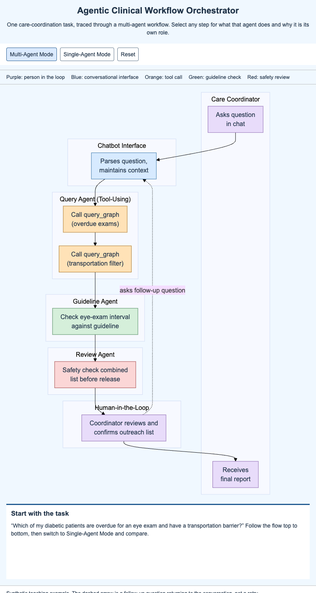Agentic Clinical Workflow OrchestratorTrace one care-coordination task through a six-lane multi-agent workflow, then collapse it into a single agent to see what the decomposition buys.</a>
  <a href="ai-ml-taxonomy-healthcare/" title="AI / ML / Deep Learning Taxonomy" style="display:block;border:1px solid #e3e7ec;border-radius:8px;overflow:hidden;text-decoration:none;color:inherit;box-shadow:0 1px 3px rgba(0,0,0,0.08);">AI / ML / Deep Learning Taxonomy</a>
  <a href="ai-ml-taxonomy/" title="AI and ML Taxonomy in Healthcare" style="display:block;border:1px solid #e3e7ec;border-radius:8px;overflow:hidden;text-decoration:none;color:inherit;box-shadow:0 1px 3px rgba(0,0,0,0.08);">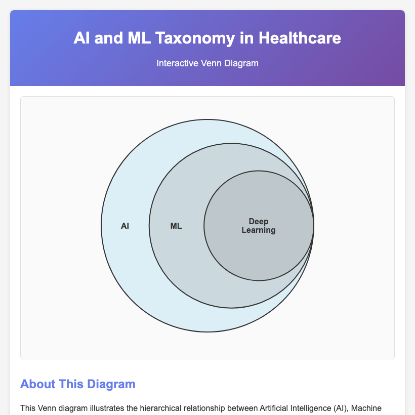AI and ML Taxonomy in Healthcare</a>
  <a href="allowed-amount-reimbursement-breakdown-chart/" title="Allowed Amount and Reimbursement Breakdown Chart" style="display:block;border:1px solid #e3e7ec;border-radius:8px;overflow:hidden;text-decoration:none;color:inherit;box-shadow:0 1px 3px rgba(0,0,0,0.08);">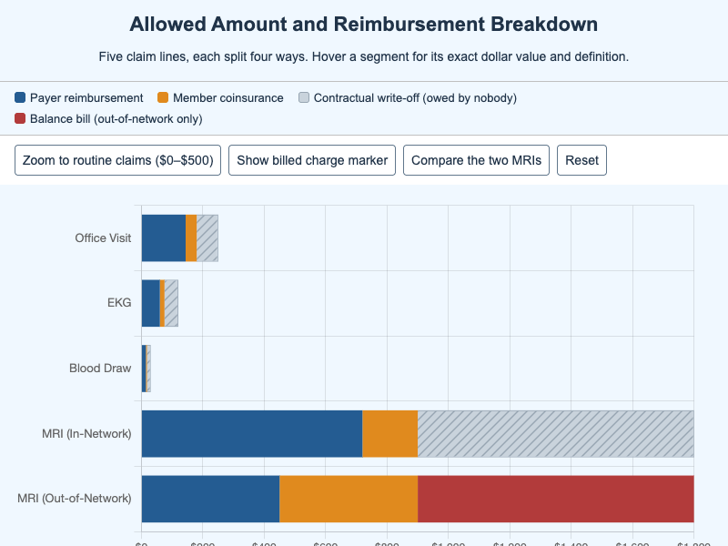Allowed Amount and Reimbursement Breakdown ChartSplit five claim lines into payer reimbursement, member coinsurance, contractual write-off, and balance bill, and price the difference network status makes.</a>
  <a href="anomaly-score-threshold-explorer/" title="Anomaly Score Threshold Explorer MicroSim" style="display:block;border:1px solid #e3e7ec;border-radius:8px;overflow:hidden;text-decoration:none;color:inherit;box-shadow:0 1px 3px rgba(0,0,0,0.08);">Anomaly Score Threshold Explorer MicroSim</a>
  <a href="appointment-no-show-simulator/" title="Appointment Scheduling and No-Show Simulator MicroSim" style="display:block;border:1px solid #e3e7ec;border-radius:8px;overflow:hidden;text-decoration:none;color:inherit;box-shadow:0 1px 3px rgba(0,0,0,0.08);">Appointment Scheduling and No-Show Simulator MicroSim</a>
  <a href="audit-trail-analysis-microsim/" title="Audit Trail Analysis MicroSim" style="display:block;border:1px solid #e3e7ec;border-radius:8px;overflow:hidden;text-decoration:none;color:inherit;box-shadow:0 1px 3px rgba(0,0,0,0.08);">Audit Trail Analysis MicroSim</a>
  <a href="authentication-authorization-comparison-infographic/" title="Authentication vs Authorization Comparison Infographic" style="display:block;border:1px solid #e3e7ec;border-radius:8px;overflow:hidden;text-decoration:none;color:inherit;box-shadow:0 1px 3px rgba(0,0,0,0.08);">Authentication vs Authorization Comparison Infographic</a>
  <a href="basic-healthcare-graph-model-diagram/" title="Basic Healthcare Graph Model" style="display:block;border:1px solid #e3e7ec;border-radius:8px;overflow:hidden;text-decoration:none;color:inherit;box-shadow:0 1px 3px rgba(0,0,0,0.08);">Basic Healthcare Graph Model</a>
  <a href="bayesian-diagnostic-reasoning/" title="Bayesian Diagnostic Reasoning MicroSim" style="display:block;border:1px solid #e3e7ec;border-radius:8px;overflow:hidden;text-decoration:none;color:inherit;box-shadow:0 1px 3px rgba(0,0,0,0.08);">Bayesian Diagnostic Reasoning MicroSim</a>
  <a href="behavioral-health-fraud-network-microsim/" title="Behavioral Health Fraud Network Interactive MicroSim" style="display:block;border:1px solid #e3e7ec;border-radius:8px;overflow:hidden;text-decoration:none;color:inherit;box-shadow:0 1px 3px rgba(0,0,0,0.08);">Behavioral Health Fraud Network Interactive MicroSim</a>
  <a href="behavioral-health-screening-graph-model/" title="Behavioral Health Screening Graph Model" style="display:block;border:1px solid #e3e7ec;border-radius:8px;overflow:hidden;text-decoration:none;color:inherit;box-shadow:0 1px 3px rgba(0,0,0,0.08);">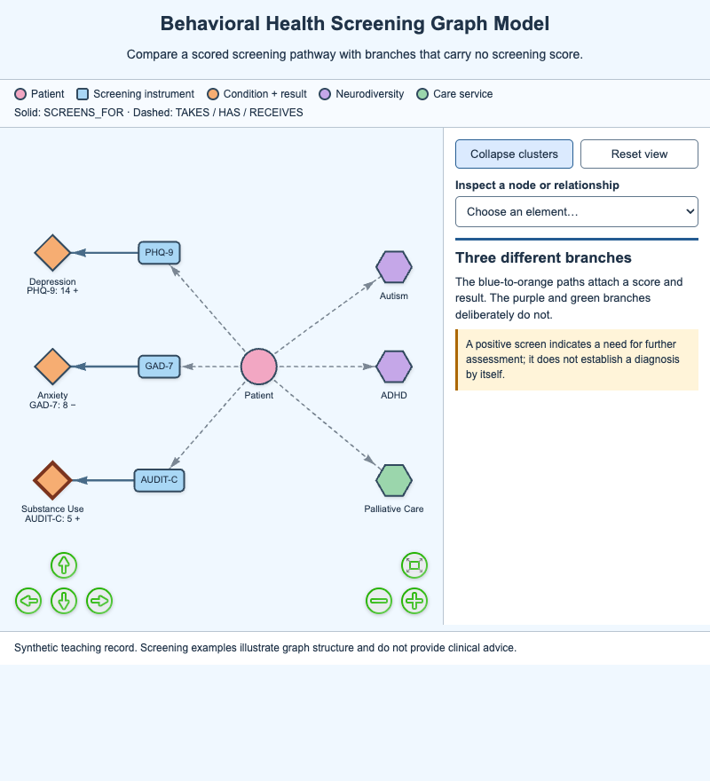Behavioral Health Screening Graph ModelCompare scored behavioral-health screening paths with structurally separate neurodiversity and palliative-care branches.</a>
  <a href="capstone-project-architecture-template/" title="Capstone Project Architecture Template" style="display:block;border:1px solid #e3e7ec;border-radius:8px;overflow:hidden;text-decoration:none;color:inherit;box-shadow:0 1px 3px rgba(0,0,0,0.08);">Capstone Project Architecture Template</a>
  <a href="care-pathway-comparison-chart/" title="Care Pathway Comparison Chart" style="display:block;border:1px solid #e3e7ec;border-radius:8px;overflow:hidden;text-decoration:none;color:inherit;box-shadow:0 1px 3px rgba(0,0,0,0.08);">Care Pathway Comparison Chart</a>
  <a href="care-pathway-shortest-path-microsim/" title="Care Pathway Shortest Path Interactive MicroSim" style="display:block;border:1px solid #e3e7ec;border-radius:8px;overflow:hidden;text-decoration:none;color:inherit;box-shadow:0 1px 3px rgba(0,0,0,0.08);">Care Pathway Shortest Path Interactive MicroSim</a>
  <a href="care-setting-acuity-flow-diagram/" title="Care Setting Acuity Flow Diagram" style="display:block;border:1px solid #e3e7ec;border-radius:8px;overflow:hidden;text-decoration:none;color:inherit;box-shadow:0 1px 3px rgba(0,0,0,0.08);">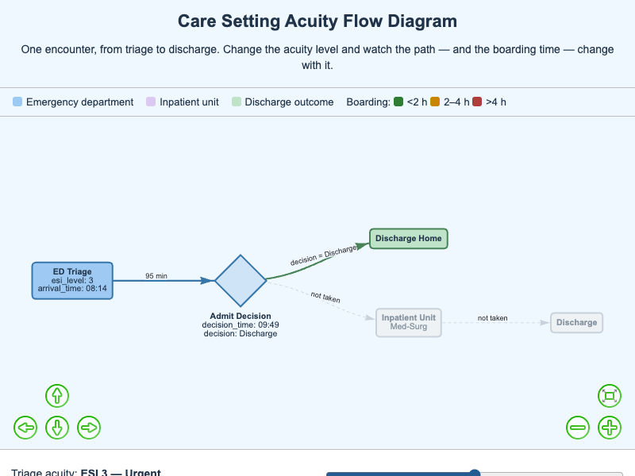Care Setting Acuity Flow DiagramTrace one encounter from emergency department triage to discharge, watching the admit branch and the boarding-time edge property change with acuity.</a>
  <a href="cds-hooks-request-response-cycle/" title="CDS Hooks Request-Response Cycle" style="display:block;border:1px solid #e3e7ec;border-radius:8px;overflow:hidden;text-decoration:none;color:inherit;box-shadow:0 1px 3px rgba(0,0,0,0.08);">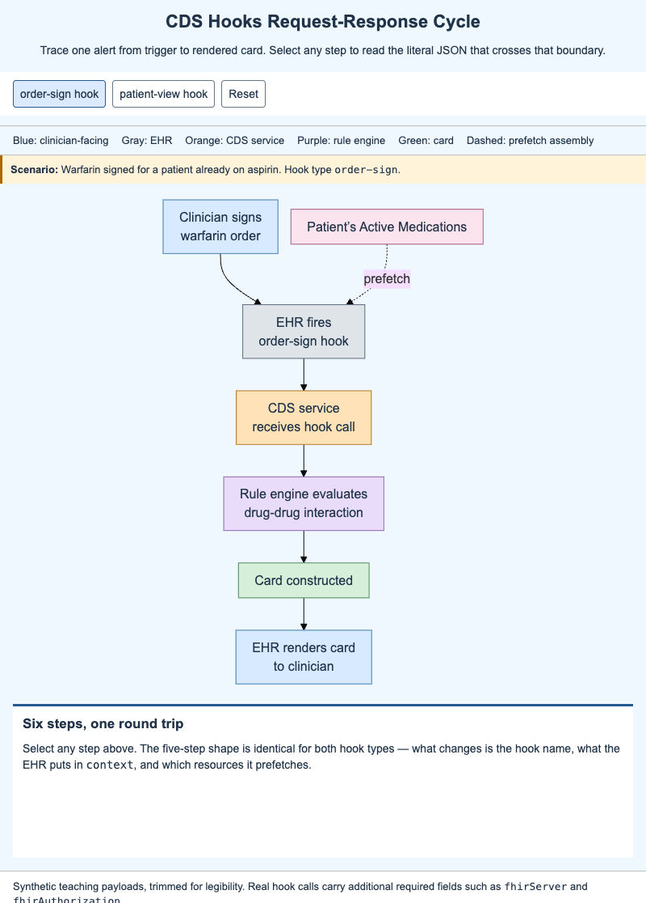CDS Hooks Request-Response CycleTrace a warfarin drug-interaction alert and a diabetes care-gap alert through the identical six-step CDS Hooks cycle, reading the literal JSON at each boundary.</a>
  <a href="centrality-measures-comparison/" title="Centrality Measures Comparison MicroSim" style="display:block;border:1px solid #e3e7ec;border-radius:8px;overflow:hidden;text-decoration:none;color:inherit;box-shadow:0 1px 3px rgba(0,0,0,0.08);">Centrality Measures Comparison MicroSim</a>
  <a href="charge-master-billing-code-graph-model/" title="Charge Master and Billing Code Graph Model" style="display:block;border:1px solid #e3e7ec;border-radius:8px;overflow:hidden;text-decoration:none;color:inherit;box-shadow:0 1px 3px rgba(0,0,0,0.08);">Charge Master and Billing Code Graph Model</a>
  <a href="claims-clearinghouse-eligibility-verification-workflow/" title="Claims Clearinghouse and Eligibility Verification Workflow" style="display:block;border:1px solid #e3e7ec;border-radius:8px;overflow:hidden;text-decoration:none;color:inherit;box-shadow:0 1px 3px rgba(0,0,0,0.08);">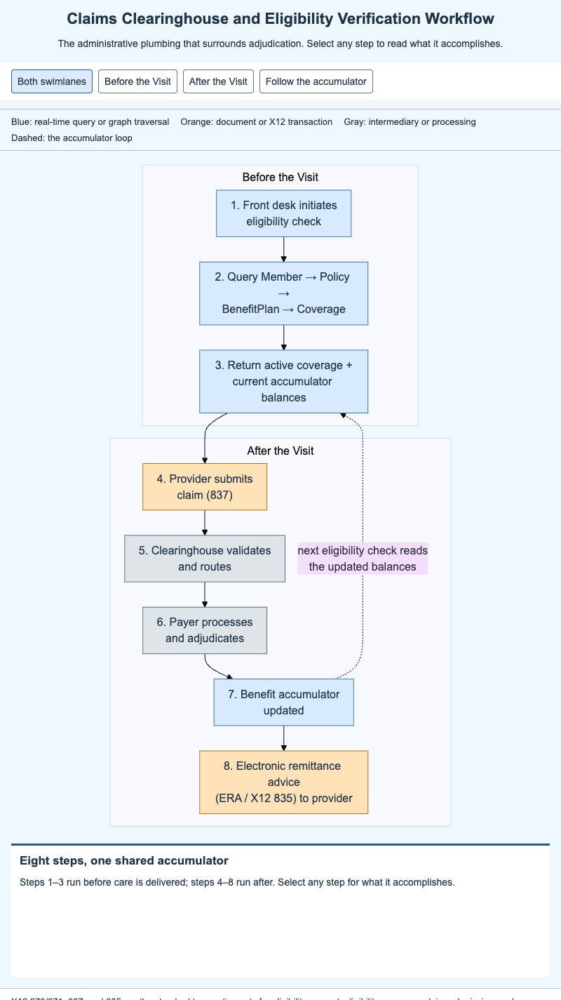Claims Clearinghouse and Eligibility Verification WorkflowFollow the administrative plumbing around claim adjudication -- eligibility verification, clearinghouse routing, and remittance -- and the benefit accumulator both halves share.</a>
  <a href="claims-lifecycle-workflow-graph-database-integration/" title="Claims Lifecycle Workflow with Graph Database Integration" style="display:block;border:1px solid #e3e7ec;border-radius:8px;overflow:hidden;text-decoration:none;color:inherit;box-shadow:0 1px 3px rgba(0,0,0,0.08);">Claims Lifecycle Workflow with Graph Database Integration</a>
  <a href="clinical-decision-support-workflow/" title="Clinical Decision Support Workflow" style="display:block;border:1px solid #e3e7ec;border-radius:8px;overflow:hidden;text-decoration:none;color:inherit;box-shadow:0 1px 3px rgba(0,0,0,0.08);">Clinical Decision Support Workflow</a>
  <a href="clinical-discovery-pipeline-timeline/" title="Clinical Discovery Pipeline Timeline" style="display:block;border:1px solid #e3e7ec;border-radius:8px;overflow:hidden;text-decoration:none;color:inherit;box-shadow:0 1px 3px rgba(0,0,0,0.08);">Clinical Discovery Pipeline Timeline</a>
  <a href="clinical-encounter-workflow-diagram/" title="Clinical Encounter Workflow" style="display:block;border:1px solid #e3e7ec;border-radius:8px;overflow:hidden;text-decoration:none;color:inherit;box-shadow:0 1px 3px rgba(0,0,0,0.08);">Clinical Encounter Workflow</a>
  <a href="clinical-nlp-pipeline-explorer/" title="Clinical NLP Pipeline Explorer" style="display:block;border:1px solid #e3e7ec;border-radius:8px;overflow:hidden;text-decoration:none;color:inherit;box-shadow:0 1px 3px rgba(0,0,0,0.08);">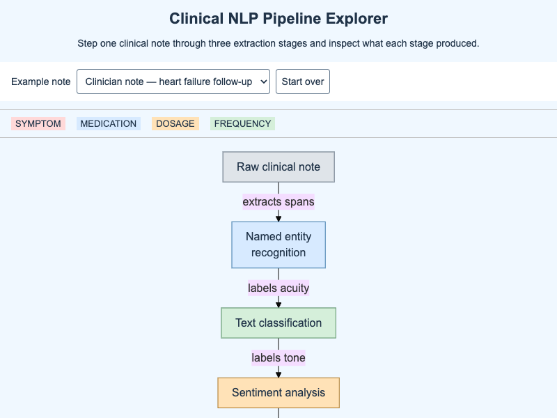Clinical NLP Pipeline ExplorerStep a clinical note through named entity recognition, classification, and sentiment analysis, inspecting the concrete output of each stage.</a>
  <a href="clinical-protocol-workflow-chest-pain-evaluation/" title="Clinical Protocol Workflow: Chest Pain Evaluation in Emergency Department" style="display:block;border:1px solid #e3e7ec;border-radius:8px;overflow:hidden;text-decoration:none;color:inherit;box-shadow:0 1px 3px rgba(0,0,0,0.08);">Clinical Protocol Workflow: Chest Pain Evaluation in Emergency Department</a>
  <a href="clinical-quality-measure-population-funnel/" title="Clinical Quality Measure Population Funnel" style="display:block;border:1px solid #e3e7ec;border-radius:8px;overflow:hidden;text-decoration:none;color:inherit;box-shadow:0 1px 3px rgba(0,0,0,0.08);">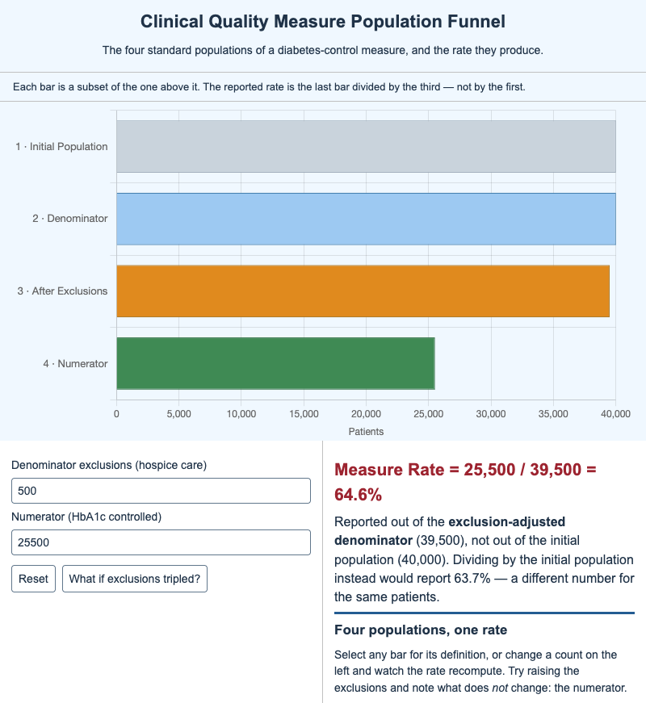Clinical Quality Measure Population FunnelCompute a quality measure's reported rate from four populations, and watch the rate move when only the exclusion count changes.</a>
  <a href="clinical-care-pathway-dag/" title="clinical-care-pathway-dag" style="display:block;border:1px solid #e3e7ec;border-radius:8px;overflow:hidden;text-decoration:none;color:inherit;box-shadow:0 1px 3px rgba(0,0,0,0.08);">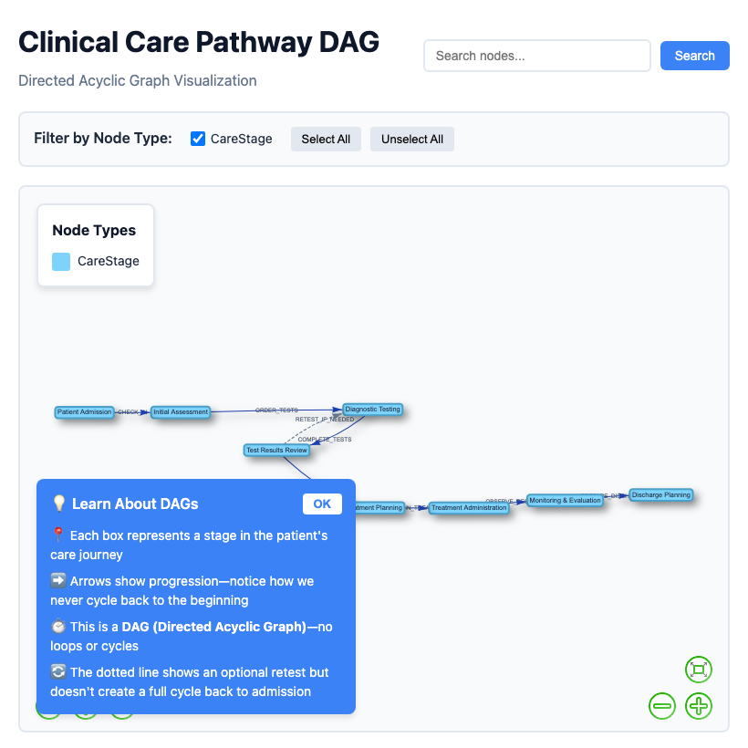clinical-care-pathway-dag</a>
  <a href="cms-cql-measure-certification-pipeline/" title="CMS CQL Measure Development and Certification Pipeline" style="display:block;border:1px solid #e3e7ec;border-radius:8px;overflow:hidden;text-decoration:none;color:inherit;box-shadow:0 1px 3px rgba(0,0,0,0.08);">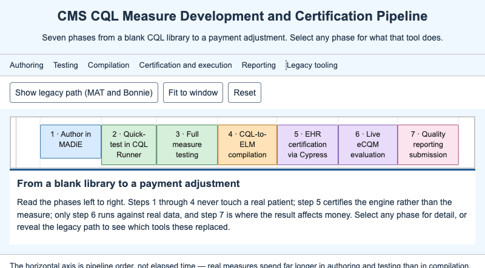CMS CQL Measure Development and Certification PipelineSequence the CMS authoring, testing, compilation, and certification tools a quality measure passes through, and see which legacy tools they replaced.</a>
  <a href="codes/" title="codes" style="display:block;border:1px solid #e3e7ec;border-radius:8px;overflow:hidden;text-decoration:none;color:inherit;box-shadow:0 1px 3px rgba(0,0,0,0.08);">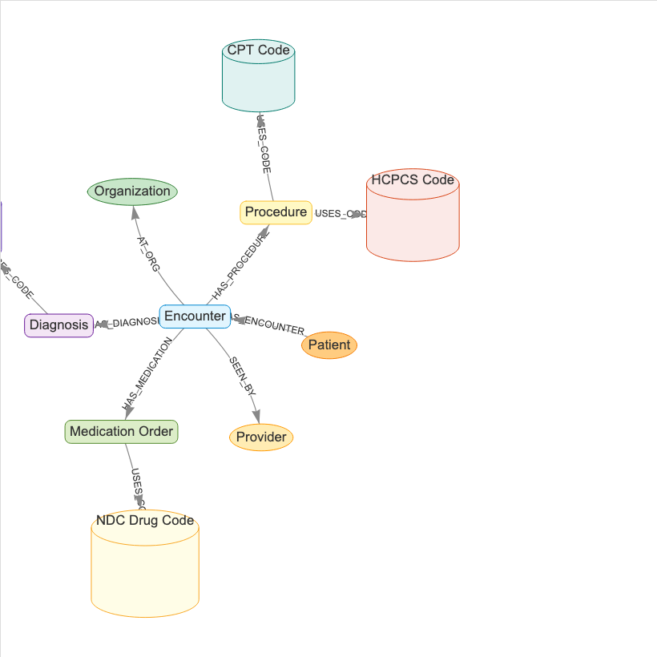codes</a>
  <a href="terminology-binding-explorer/" title="CodeSystem, ValueSet, and Terminology Binding Explorer" style="display:block;border:1px solid #e3e7ec;border-radius:8px;overflow:hidden;text-decoration:none;color:inherit;box-shadow:0 1px 3px rgba(0,0,0,0.08);">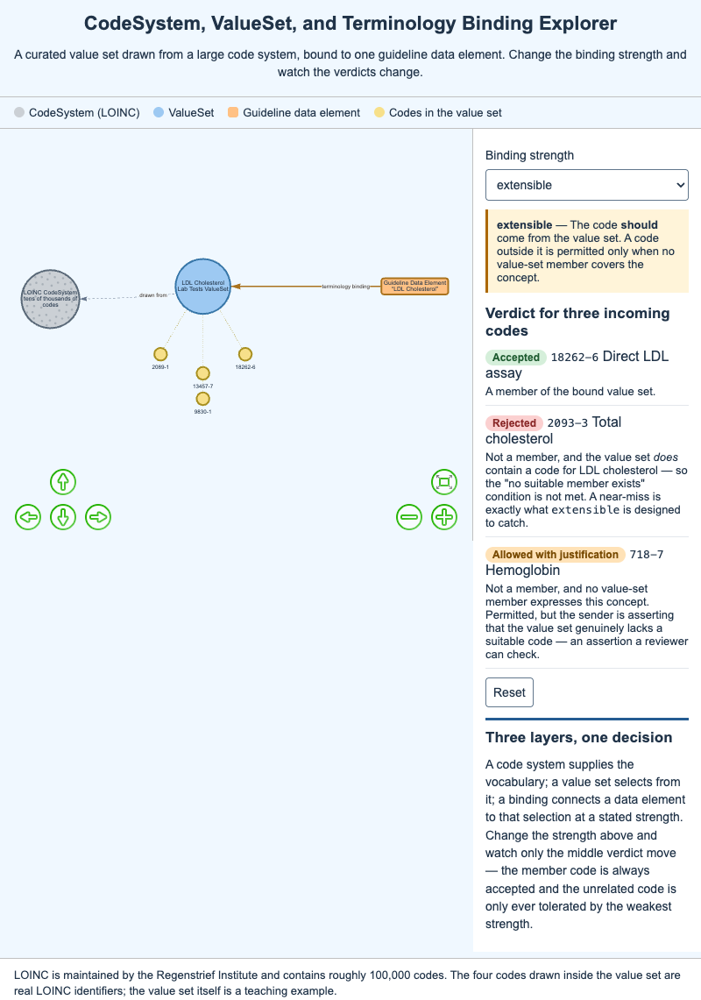CodeSystem, ValueSet, and Terminology Binding ExplorerChange a binding strength and watch three incoming LOINC codes be accepted, flagged, or rejected against a curated LDL cholesterol value set.</a>
  <a href="comparison-graph-db-llm-integrated-system/" title="Comparison: Graph DB vs LLM vs Integrated System" style="display:block;border:1px solid #e3e7ec;border-radius:8px;overflow:hidden;text-decoration:none;color:inherit;box-shadow:0 1px 3px rgba(0,0,0,0.08);">Comparison: Graph DB vs LLM vs Integrated System</a>
  <a href="cost-sharing-calculation-microsim/" title="Cost-Sharing Calculation Interactive MicroSim" style="display:block;border:1px solid #e3e7ec;border-radius:8px;overflow:hidden;text-decoration:none;color:inherit;box-shadow:0 1px 3px rgba(0,0,0,0.08);">Cost-Sharing Calculation Interactive MicroSim</a>
  <a href="cql-to-elm-compilation-pipeline/" title="CQL-to-ELM Compilation Pipeline" style="display:block;border:1px solid #e3e7ec;border-radius:8px;overflow:hidden;text-decoration:none;color:inherit;box-shadow:0 1px 3px rgba(0,0,0,0.08);">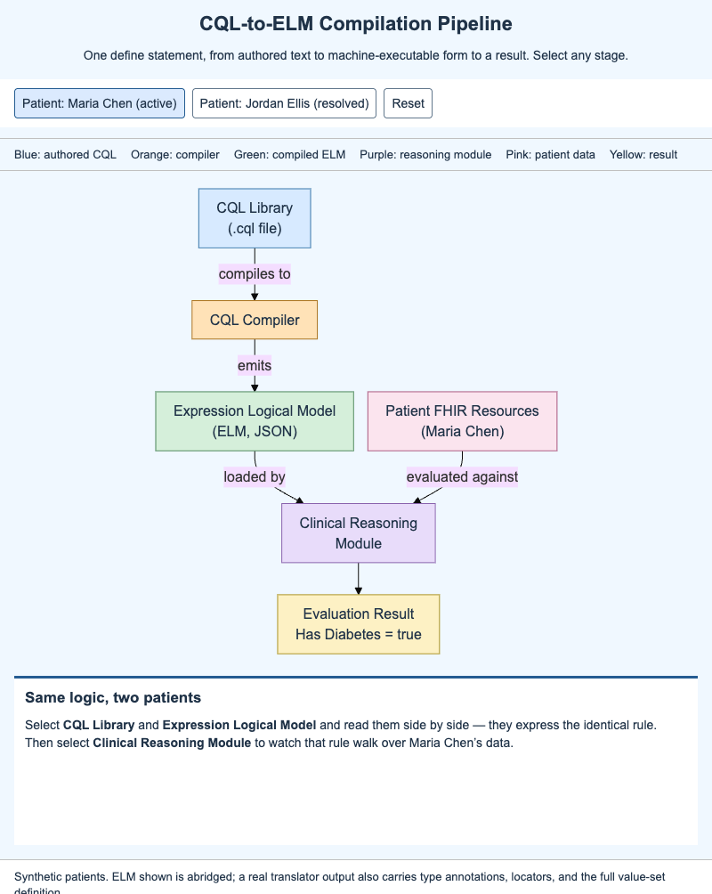CQL-to-ELM Compilation PipelineRead one define statement as authored CQL and as compiled ELM, then watch a reasoning engine evaluate it against two patients with opposite results.</a>
  <a href="cycle-detection-pattern-explorer/" title="Cycle Detection and Pattern Explorer MicroSim" style="display:block;border:1px solid #e3e7ec;border-radius:8px;overflow:hidden;text-decoration:none;color:inherit;box-shadow:0 1px 3px rgba(0,0,0,0.08);">Cycle Detection and Pattern Explorer MicroSim</a>
  <a href="cypher-query-components-infographic/" title="Cypher Query Components Interactive Infographic" style="display:block;border:1px solid #e3e7ec;border-radius:8px;overflow:hidden;text-decoration:none;color:inherit;box-shadow:0 1px 3px rgba(0,0,0,0.08);">Cypher Query Components Interactive Infographic</a>
  <a href="data-governance-framework-pillars/" title="Data Governance Framework Pillars" style="display:block;border:1px solid #e3e7ec;border-radius:8px;overflow:hidden;text-decoration:none;color:inherit;box-shadow:0 1px 3px rgba(0,0,0,0.08);">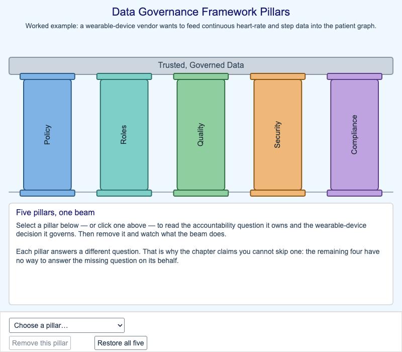Data Governance Framework PillarsRemove any one of the five governance pillars and watch the beam it supports tilt, using a wearable-device data source as the running example.</a>
  <a href="data-integration-flow-infographic/" title="Data Integration Flow Interactive Infographic" style="display:block;border:1px solid #e3e7ec;border-radius:8px;overflow:hidden;text-decoration:none;color:inherit;box-shadow:0 1px 3px rgba(0,0,0,0.08);">Data Integration Flow Interactive Infographic</a>
  <a href="data-quality-dashboard-chart/" title="Data Quality Dashboard Chart" style="display:block;border:1px solid #e3e7ec;border-radius:8px;overflow:hidden;text-decoration:none;color:inherit;box-shadow:0 1px 3px rgba(0,0,0,0.08);">Data Quality Dashboard Chart</a>
  <a href="data-quality-impact-analysis-microsim/" title="Data Quality Impact Analysis MicroSim" style="display:block;border:1px solid #e3e7ec;border-radius:8px;overflow:hidden;text-decoration:none;color:inherit;box-shadow:0 1px 3px rgba(0,0,0,0.08);">Data Quality Impact Analysis MicroSim</a>
  <a href="de-identification-techniques-comparison-table/" title="De-Identification Techniques Comparison Table" style="display:block;border:1px solid #e3e7ec;border-radius:8px;overflow:hidden;text-decoration:none;color:inherit;box-shadow:0 1px 3px rgba(0,0,0,0.08);">De-Identification Techniques Comparison Table</a>
  <a href="denial-reasons-analysis-chart/" title="Denial Reasons Analysis Chart" style="display:block;border:1px solid #e3e7ec;border-radius:8px;overflow:hidden;text-decoration:none;color:inherit;box-shadow:0 1px 3px rgba(0,0,0,0.08);">Denial Reasons Analysis Chart</a>
  <a href="directed-acyclic-graph-care-pathway/" title="Directed Acyclic Graph Example: Care Pathway" style="display:block;border:1px solid #e3e7ec;border-radius:8px;overflow:hidden;text-decoration:none;color:inherit;box-shadow:0 1px 3px rgba(0,0,0,0.08);">Directed Acyclic Graph Example: Care Pathway</a>
  <a href="dme-fraud-pattern-detector/" title="DME Fraud Pattern Detector MicroSim" style="display:block;border:1px solid #e3e7ec;border-radius:8px;overflow:hidden;text-decoration:none;color:inherit;box-shadow:0 1px 3px rgba(0,0,0,0.08);">DME Fraud Pattern Detector MicroSim</a>
  <a href="encounter-workflow/" title="encounter-workflow" style="display:block;border:1px solid #e3e7ec;border-radius:8px;overflow:hidden;text-decoration:none;color:inherit;box-shadow:0 1px 3px rgba(0,0,0,0.08);">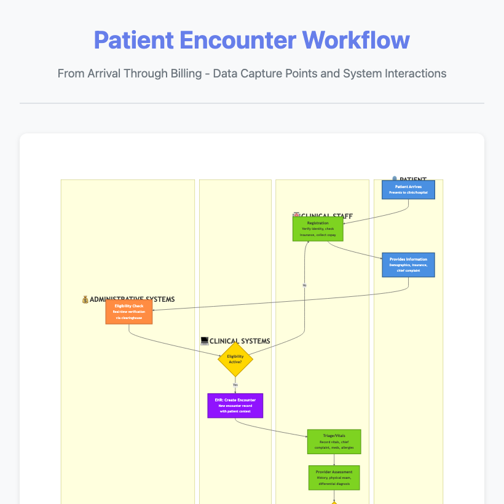encounter-workflow</a>
  <a href="evolution-graph-query-languages-timeline/" title="Evolution of Graph Query Languages Timeline" style="display:block;border:1px solid #e3e7ec;border-radius:8px;overflow:hidden;text-decoration:none;color:inherit;box-shadow:0 1px 3px rgba(0,0,0,0.08);">Evolution of Graph Query Languages Timeline</a>
  <a href="explainable-ai-recommendation-workflow/" title="Explainable AI Recommendation Workflow" style="display:block;border:1px solid #e3e7ec;border-radius:8px;overflow:hidden;text-decoration:none;color:inherit;box-shadow:0 1px 3px rgba(0,0,0,0.08);">Explainable AI Recommendation Workflow</a>
  <a href="fhir-resource-bundle-explorer/" title="FHIR Resource Bundle Explorer" style="display:block;border:1px solid #e3e7ec;border-radius:8px;overflow:hidden;text-decoration:none;color:inherit;box-shadow:0 1px 3px rgba(0,0,0,0.08);">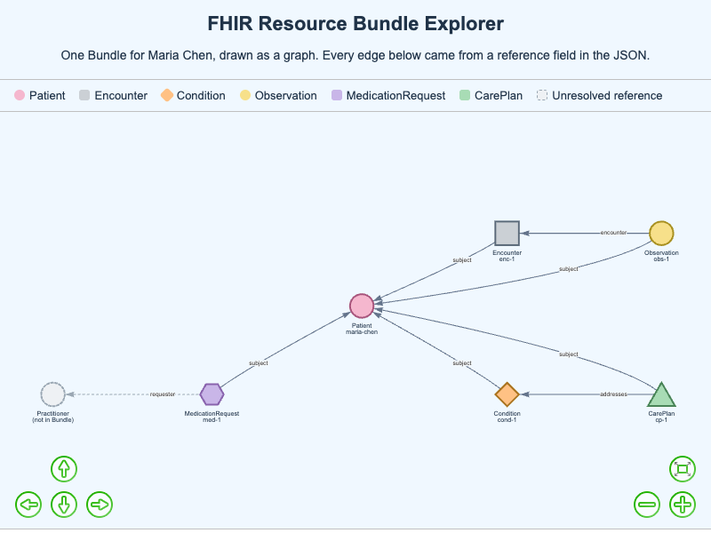FHIR Resource Bundle ExplorerRender a FHIR Bundle as a node-and-edge graph and match every drawn edge to the JSON reference field that produced it.</a>
  <a href="fhir-restful-api-request-response-flow/" title="FHIR RESTful API Request-Response Flow" style="display:block;border:1px solid #e3e7ec;border-radius:8px;overflow:hidden;text-decoration:none;color:inherit;box-shadow:0 1px 3px rgba(0,0,0,0.08);">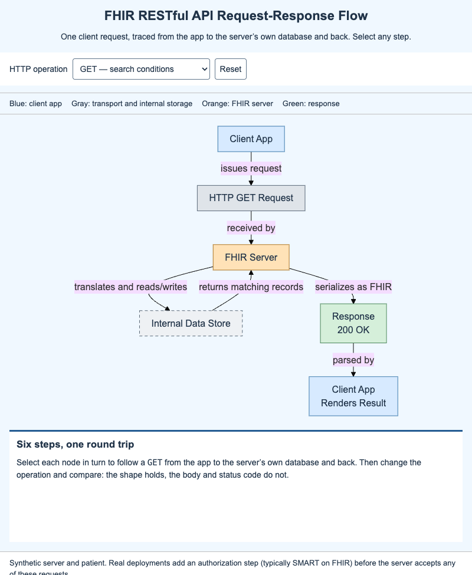FHIR RESTful API Request-Response FlowTrace a client request through a FHIR server to its own database and back, switching between GET, POST, PUT, and DELETE to see what changes and what does not.</a>
  <a href="formulary-management-step-therapy-graph-model/" title="Formulary Management and Step Therapy Graph Model" style="display:block;border:1px solid #e3e7ec;border-radius:8px;overflow:hidden;text-decoration:none;color:inherit;box-shadow:0 1px 3px rgba(0,0,0,0.08);">Formulary Management and Step Therapy Graph Model</a>
  <a href="graph-algorithm-family-map/" title="Graph Algorithm Family Map" style="display:block;border:1px solid #e3e7ec;border-radius:8px;overflow:hidden;text-decoration:none;color:inherit;box-shadow:0 1px 3px rgba(0,0,0,0.08);">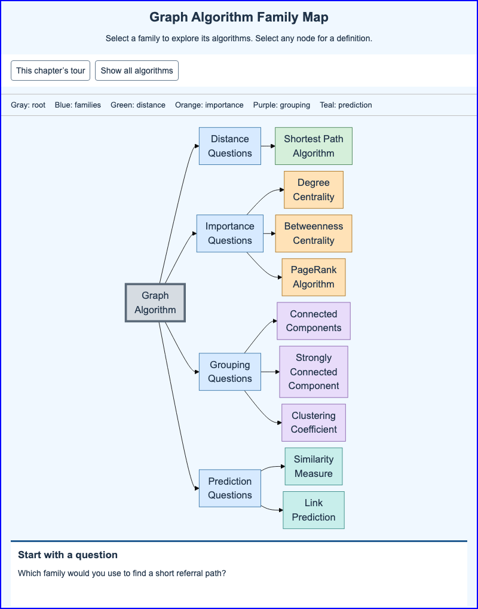Graph Algorithm Family MapClassify a graph algorithm by the type of question it answers (distance, importance, grouping, or prediction) and summarize one example algorithm per family.</a>
  <a href="graph-rbac-workflow-diagram/" title="Graph RBAC Workflow Diagram" style="display:block;border:1px solid #e3e7ec;border-radius:8px;overflow:hidden;text-decoration:none;color:inherit;box-shadow:0 1px 3px rgba(0,0,0,0.08);">Graph RBAC Workflow Diagram</a>
  <a href="graph-sharding-partition-explorer/" title="Graph Sharding Partition Explorer" style="display:block;border:1px solid #e3e7ec;border-radius:8px;overflow:hidden;text-decoration:none;color:inherit;box-shadow:0 1px 3px rgba(0,0,0,0.08);">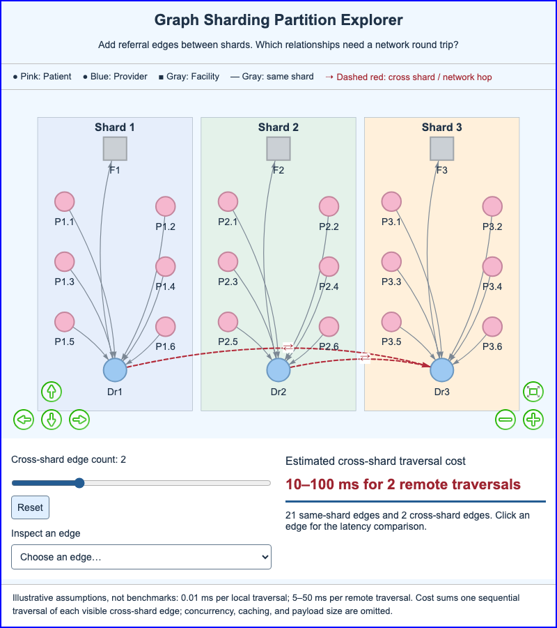Graph Sharding Partition ExplorerGiven a patient graph partitioned across three shards, the learner can distinguish same-shard edges from cross-shard edges and examine why cross-shard traversal costs more.</a>
  <a href="graph-traversal-visualization-microsim/" title="Graph Traversal Visualization MicroSim" style="display:block;border:1px solid #e3e7ec;border-radius:8px;overflow:hidden;text-decoration:none;color:inherit;box-shadow:0 1px 3px rgba(0,0,0,0.08);">Graph Traversal Visualization MicroSim</a>
  <a href="graph-based-fraud-detection-algorithm-workflow/" title="Graph-Based Fraud Detection Algorithm Workflow" style="display:block;border:1px solid #e3e7ec;border-radius:8px;overflow:hidden;text-decoration:none;color:inherit;box-shadow:0 1px 3px rgba(0,0,0,0.08);">Graph-Based Fraud Detection Algorithm Workflow</a>
  <a href="graph-viewer/" title="graph-viewer" style="display:block;border:1px solid #e3e7ec;border-radius:8px;overflow:hidden;text-decoration:none;color:inherit;box-shadow:0 1px 3px rgba(0,0,0,0.08);">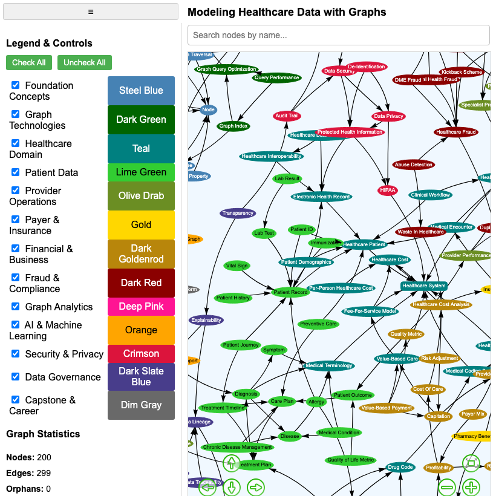graph-viewer</a>
  <a href="gsql-accumulator-pattern-microsim/" title="GSQL Accumulator Pattern MicroSim" style="display:block;border:1px solid #e3e7ec;border-radius:8px;overflow:hidden;text-decoration:none;color:inherit;box-shadow:0 1px 3px rgba(0,0,0,0.08);">GSQL Accumulator Pattern MicroSim</a>
  <a href="guideline-authoring-artifacts-explorer/" title="Guideline Authoring Artifacts Explorer" style="display:block;border:1px solid #e3e7ec;border-radius:8px;overflow:hidden;text-decoration:none;color:inherit;box-shadow:0 1px 3px rgba(0,0,0,0.08);">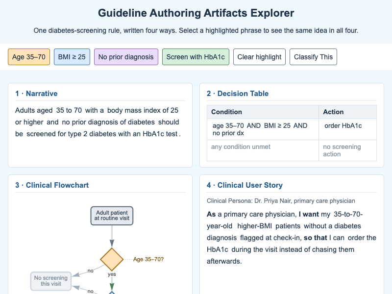Guideline Authoring Artifacts ExplorerSee one diabetes-screening rule as narrative, decision table, flowchart, and user story, with color-linked highlighting across all four.</a>
  <a href="healthcare-analytics-platform-architecture-diagram/" title="Healthcare Analytics Platform Architecture Diagram" style="display:block;border:1px solid #e3e7ec;border-radius:8px;overflow:hidden;text-decoration:none;color:inherit;box-shadow:0 1px 3px rgba(0,0,0,0.08);">Healthcare Analytics Platform Architecture Diagram</a>
  <a href="healthcare-data-integration-graph-model/" title="Healthcare Data Integration Graph Model" style="display:block;border:1px solid #e3e7ec;border-radius:8px;overflow:hidden;text-decoration:none;color:inherit;box-shadow:0 1px 3px rgba(0,0,0,0.08);">Healthcare Data Integration Graph Model</a>
  <a href="healthcare-data-lineage-graph-visualization/" title="Healthcare Data Lineage Graph Visualization" style="display:block;border:1px solid #e3e7ec;border-radius:8px;overflow:hidden;text-decoration:none;color:inherit;box-shadow:0 1px 3px rgba(0,0,0,0.08);">Healthcare Data Lineage Graph Visualization</a>
  <a href="healthcare-data-model-implementation-workflow/" title="Healthcare Data Model Implementation Workflow" style="display:block;border:1px solid #e3e7ec;border-radius:8px;overflow:hidden;text-decoration:none;color:inherit;box-shadow:0 1px 3px rgba(0,0,0,0.08);">Healthcare Data Model Implementation Workflow</a>
  <a href="healthcare-data-protection-layers-diagram/" title="Healthcare Data Protection Layers Diagram" style="display:block;border:1px solid #e3e7ec;border-radius:8px;overflow:hidden;text-decoration:none;color:inherit;box-shadow:0 1px 3px rgba(0,0,0,0.08);">Healthcare Data Protection Layers Diagram</a>
  <a href="data-sensitivity-classification-levels/" title="Healthcare Data Sensitivity Classification Levels" style="display:block;border:1px solid #e3e7ec;border-radius:8px;overflow:hidden;text-decoration:none;color:inherit;box-shadow:0 1px 3px rgba(0,0,0,0.08);">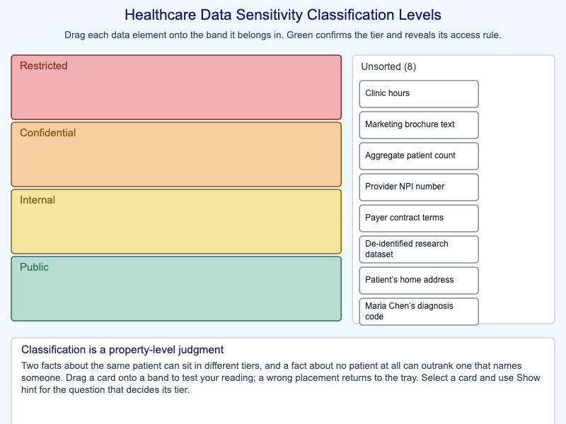Healthcare Data Sensitivity Classification LevelsSort eight healthcare data elements into four sensitivity tiers by dragging, with immediate feedback and the access rule each tier carries.</a>
  <a href="healthcare-delivery-network-graph-model/" title="Healthcare Delivery Network Graph Model" style="display:block;border:1px solid #e3e7ec;border-radius:8px;overflow:hidden;text-decoration:none;color:inherit;box-shadow:0 1px 3px rgba(0,0,0,0.08);">Healthcare Delivery Network Graph Model</a>
  <a href="healthcare-ecosystem-stakeholder-diagram/" title="Healthcare Ecosystem Stakeholder Diagram" style="display:block;border:1px solid #e3e7ec;border-radius:8px;overflow:hidden;text-decoration:none;color:inherit;box-shadow:0 1px 3px rgba(0,0,0,0.08);">Healthcare Ecosystem Stakeholder Diagram</a>
  <a href="healthcare-fraud-scheme-network-visualization/" title="Healthcare Fraud Scheme Network Visualization" style="display:block;border:1px solid #e3e7ec;border-radius:8px;overflow:hidden;text-decoration:none;color:inherit;box-shadow:0 1px 3px rgba(0,0,0,0.08);">Healthcare Fraud Scheme Network Visualization</a>
  <a href="healthcare-graph-anatomy-explorer/" title="Healthcare Graph Anatomy Explorer" style="display:block;border:1px solid #e3e7ec;border-radius:8px;overflow:hidden;text-decoration:none;color:inherit;box-shadow:0 1px 3px rgba(0,0,0,0.08);">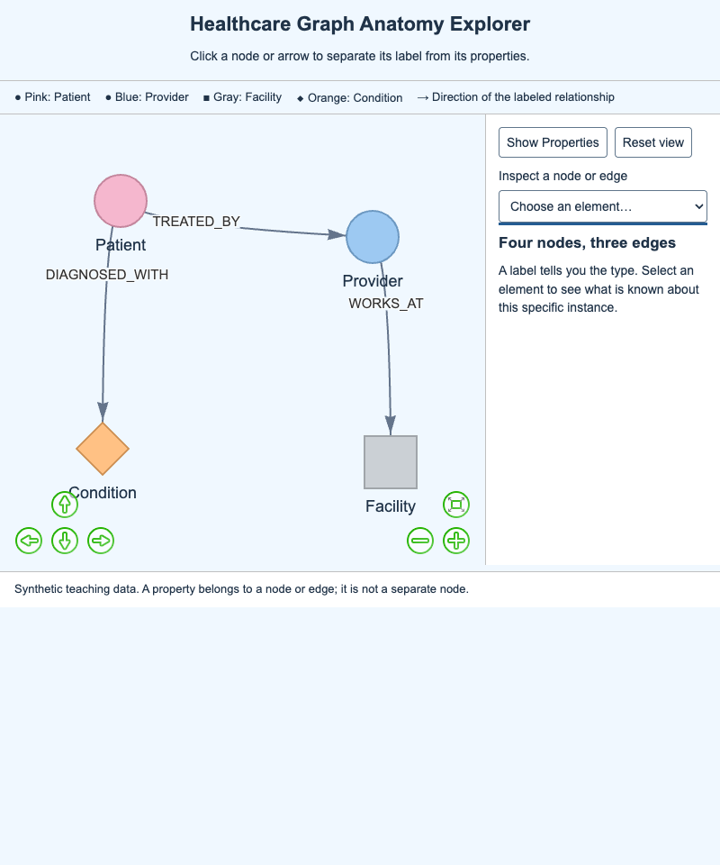Healthcare Graph Anatomy ExplorerGiven a rendered labeled property graph, the learner can identify which visual elements are nodes and which are edges, and state the label and properties of each.</a>
  <a href="healthcare-graph-database-job-roles-skills/" title="Healthcare Graph Database Job Roles and Skills Map" style="display:block;border:1px solid #e3e7ec;border-radius:8px;overflow:hidden;text-decoration:none;color:inherit;box-shadow:0 1px 3px rgba(0,0,0,0.08);">Healthcare Graph Database Job Roles and Skills Map</a>
  <a href="healthcare-graph-pattern-examples/" title="Healthcare Graph Pattern Examples" style="display:block;border:1px solid #e3e7ec;border-radius:8px;overflow:hidden;text-decoration:none;color:inherit;box-shadow:0 1px 3px rgba(0,0,0,0.08);">Healthcare Graph Pattern Examples</a>
  <a href="healthcare-labeled-property-graph-visualization/" title="Healthcare Labeled Property Graph Visualization" style="display:block;border:1px solid #e3e7ec;border-radius:8px;overflow:hidden;text-decoration:none;color:inherit;box-shadow:0 1px 3px rgba(0,0,0,0.08);">Healthcare Labeled Property Graph Visualization</a>
  <a href="healthcare-payment-model-comparison-microsim/" title="Healthcare Payment Model Comparison MicroSim" style="display:block;border:1px solid #e3e7ec;border-radius:8px;overflow:hidden;text-decoration:none;color:inherit;box-shadow:0 1px 3px rgba(0,0,0,0.08);">Healthcare Payment Model Comparison MicroSim</a>
  <a href="healthcare-rbac-graph-data-model/" title="Healthcare RBAC Graph Data Model" style="display:block;border:1px solid #e3e7ec;border-radius:8px;overflow:hidden;text-decoration:none;color:inherit;box-shadow:0 1px 3px rgba(0,0,0,0.08);">Healthcare RBAC Graph Data Model</a>
  <a href="healthcare-revenue-cycle-workflow-graph-analytics/" title="Healthcare Revenue Cycle Workflow with Graph Analytics" style="display:block;border:1px solid #e3e7ec;border-radius:8px;overflow:hidden;text-decoration:none;color:inherit;box-shadow:0 1px 3px rgba(0,0,0,0.08);">Healthcare Revenue Cycle Workflow with Graph Analytics</a>
  <a href="healthcare-graph-fundamentals/" title="healthcare-graph-fundamentals" style="display:block;border:1px solid #e3e7ec;border-radius:8px;overflow:hidden;text-decoration:none;color:inherit;box-shadow:0 1px 3px rgba(0,0,0,0.08);">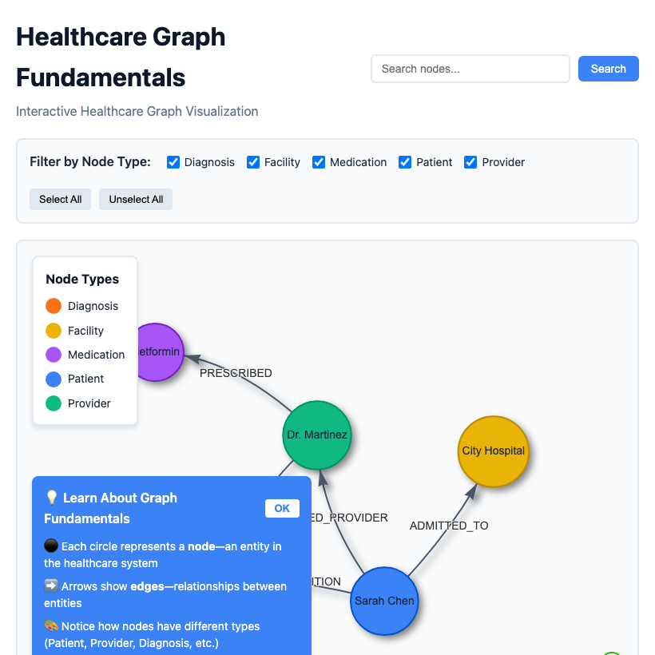healthcare-graph-fundamentals</a>
  <a href="hipaa-compliance-workflow-graph-database-operations/" title="HIPAA Compliance Workflow for Graph Database Operations" style="display:block;border:1px solid #e3e7ec;border-radius:8px;overflow:hidden;text-decoration:none;color:inherit;box-shadow:0 1px 3px rgba(0,0,0,0.08);">HIPAA Compliance Workflow for Graph Database Operations</a>
  <a href="insurance-policy-benefit-plan-graph-model/" title="Insurance Policy and Benefit Plan Graph Model" style="display:block;border:1px solid #e3e7ec;border-radius:8px;overflow:hidden;text-decoration:none;color:inherit;box-shadow:0 1px 3px rgba(0,0,0,0.08);">Insurance Policy and Benefit Plan Graph Model</a>
  <a href="knowledge-representation-levels-tier-matrix/" title="Knowledge Representation Levels by Functional Tier Matrix" style="display:block;border:1px solid #e3e7ec;border-radius:8px;overflow:hidden;text-decoration:none;color:inherit;box-shadow:0 1px 3px rgba(0,0,0,0.08);">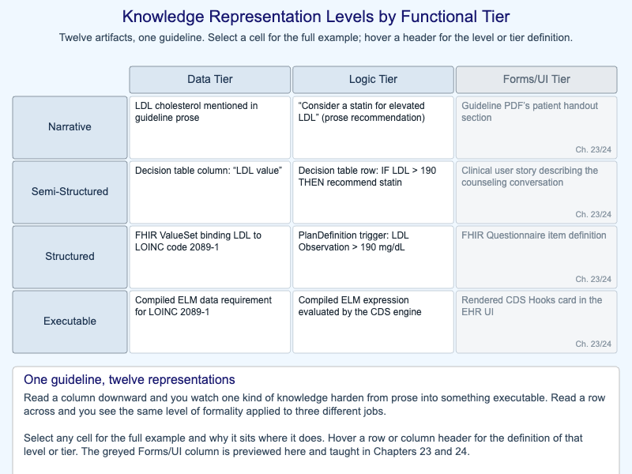Knowledge Representation Levels by Functional Tier MatrixLocate any clinical knowledge artifact by both its representation level and its functional tier in a twelve-cell reference grid.</a>
  <a href="link-prediction-scoring/" title="Link Prediction Scoring MicroSim" style="display:block;border:1px solid #e3e7ec;border-radius:8px;overflow:hidden;text-decoration:none;color:inherit;box-shadow:0 1px 3px rgba(0,0,0,0.08);">Link Prediction Scoring MicroSim</a>
  <a href="medical-code-classifier/" title="Medical Code System Classifier MicroSim" style="display:block;border:1px solid #e3e7ec;border-radius:8px;overflow:hidden;text-decoration:none;color:inherit;box-shadow:0 1px 3px rgba(0,0,0,0.08);">Medical Code System Classifier MicroSim</a>
  <a href="medical-coding-systems-infographic/" title="Medical Coding Systems Interactive Infographic" style="display:block;border:1px solid #e3e7ec;border-radius:8px;overflow:hidden;text-decoration:none;color:inherit;box-shadow:0 1px 3px rgba(0,0,0,0.08);">Medical Coding Systems Interactive Infographic</a>
  <a href="medical-knowledge-graph/" title="Medical Knowledge Graph Example" style="display:block;border:1px solid #e3e7ec;border-radius:8px;overflow:hidden;text-decoration:none;color:inherit;box-shadow:0 1px 3px rgba(0,0,0,0.08);">Medical Knowledge Graph Example</a>
  <a href="medication-effectiveness-comparison-microsim/" title="Medication Effectiveness Comparison MicroSim" style="display:block;border:1px solid #e3e7ec;border-radius:8px;overflow:hidden;text-decoration:none;color:inherit;box-shadow:0 1px 3px rgba(0,0,0,0.08);">Medication Effectiveness Comparison MicroSim</a>
  <a href="medication-safety-network-infographic/" title="Medication Safety Network Interactive Infographic" style="display:block;border:1px solid #e3e7ec;border-radius:8px;overflow:hidden;text-decoration:none;color:inherit;box-shadow:0 1px 3px rgba(0,0,0,0.08);">Medication Safety Network Interactive Infographic</a>
  <a href="migration-strategy-comparison-chart/" title="Migration Strategy Comparison Chart" style="display:block;border:1px solid #e3e7ec;border-radius:8px;overflow:hidden;text-decoration:none;color:inherit;box-shadow:0 1px 3px rgba(0,0,0,0.08);">Migration Strategy Comparison Chart</a>
  <a href="model-drift-detection-monitor/" title="Model Drift Detection Monitor" style="display:block;border:1px solid #e3e7ec;border-radius:8px;overflow:hidden;text-decoration:none;color:inherit;box-shadow:0 1px 3px rgba(0,0,0,0.08);">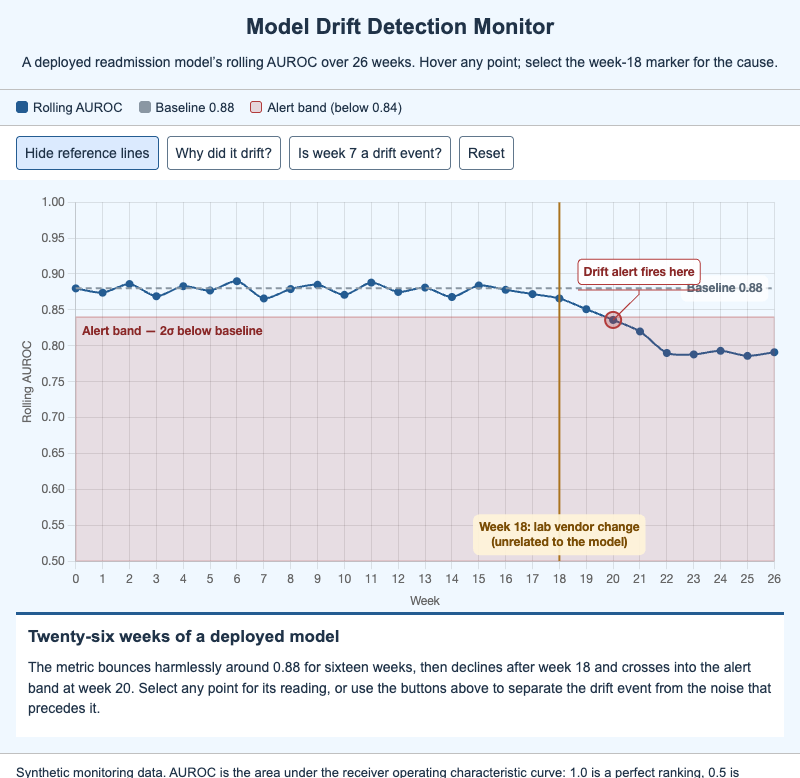Model Drift Detection MonitorRead 26 weeks of a deployed model's rolling AUROC and separate ordinary week-to-week fluctuation from a genuine drift event.</a>
  <a href="multidisciplinary-care-team-graph-model/" title="Multidisciplinary Care Team Graph Model" style="display:block;border:1px solid #e3e7ec;border-radius:8px;overflow:hidden;text-decoration:none;color:inherit;box-shadow:0 1px 3px rgba(0,0,0,0.08);">Multidisciplinary Care Team Graph Model</a>
  <a href="network-community-detection-graph-model/" title="Network Community Detection Interactive Graph Model" style="display:block;border:1px solid #e3e7ec;border-radius:8px;overflow:hidden;text-decoration:none;color:inherit;box-shadow:0 1px 3px rgba(0,0,0,0.08);">Network Community Detection Interactive Graph Model</a>
  <a href="node-embedding-explorer/" title="Node Embedding Explorer MicroSim" style="display:block;border:1px solid #e3e7ec;border-radius:8px;overflow:hidden;text-decoration:none;color:inherit;box-shadow:0 1px 3px rgba(0,0,0,0.08);">Node Embedding Explorer MicroSim</a>
  <a href="patient-clinical-context-subgraph-visualization/" title="Patient Clinical Context Subgraph Visualization" style="display:block;border:1px solid #e3e7ec;border-radius:8px;overflow:hidden;text-decoration:none;color:inherit;box-shadow:0 1px 3px rgba(0,0,0,0.08);">Patient Clinical Context Subgraph Visualization</a>
  <a href="patient-demographics-sdoh-profile/" title="Patient Demographics and SDOH Profile" style="display:block;border:1px solid #e3e7ec;border-radius:8px;overflow:hidden;text-decoration:none;color:inherit;box-shadow:0 1px 3px rgba(0,0,0,0.08);">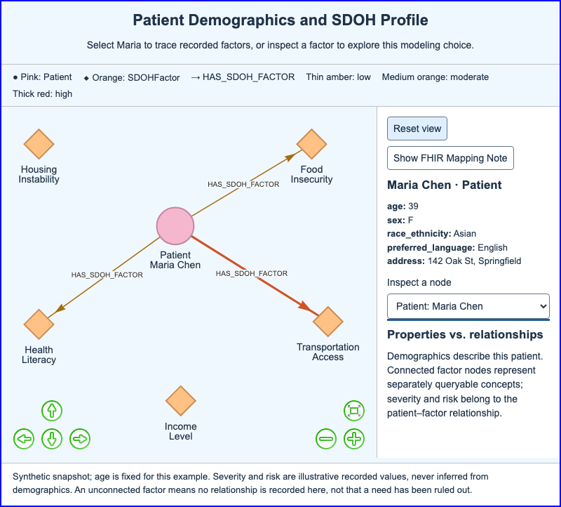Patient Demographics and SDOH ProfileGiven a patient node with demographic properties and connected SDOHFactor nodes, the learner can classify each attribute as a demographic property versus a social determinant of health and explain why each is modeled differently in a labeled property graph.</a>
  <a href="patient-identifier-graph-model/" title="Patient Identifier Graph Model" style="display:block;border:1px solid #e3e7ec;border-radius:8px;overflow:hidden;text-decoration:none;color:inherit;box-shadow:0 1px 3px rgba(0,0,0,0.08);">Patient Identifier Graph Model</a>
  <a href="patient-journey-map-visualization/" title="Patient Journey Map Interactive Visualization" style="display:block;border:1px solid #e3e7ec;border-radius:8px;overflow:hidden;text-decoration:none;color:inherit;box-shadow:0 1px 3px rgba(0,0,0,0.08);">Patient Journey Map Interactive Visualization</a>
  <a href="patient-outcome-metrics-dashboard-chart/" title="Patient Outcome Metrics Dashboard Chart" style="display:block;border:1px solid #e3e7ec;border-radius:8px;overflow:hidden;text-decoration:none;color:inherit;box-shadow:0 1px 3px rgba(0,0,0,0.08);">Patient Outcome Metrics Dashboard Chart</a>
  <a href="patient-treatment-timeline-workflow-diagram/" title="Patient Treatment Timeline Workflow Diagram" style="display:block;border:1px solid #e3e7ec;border-radius:8px;overflow:hidden;text-decoration:none;color:inherit;box-shadow:0 1px 3px rgba(0,0,0,0.08);">Patient Treatment Timeline Workflow Diagram</a>
  <a href="payer-mix-contract-negotiation/" title="Payer Mix and Contract Negotiation MicroSim" style="display:block;border:1px solid #e3e7ec;border-radius:8px;overflow:hidden;text-decoration:none;color:inherit;box-shadow:0 1px 3px rgba(0,0,0,0.08);">Payer Mix and Contract Negotiation MicroSim</a>
  <a href="per-person-healthcare-cost-comparison-chart/" title="Per-Person Healthcare Cost Comparison Chart" style="display:block;border:1px solid #e3e7ec;border-radius:8px;overflow:hidden;text-decoration:none;color:inherit;box-shadow:0 1px 3px rgba(0,0,0,0.08);">Per-Person Healthcare Cost Comparison Chart</a>
  <a href="plandefinition-activitydefinition-trigger-flow/" title="PlanDefinition to ActivityDefinition Trigger Flow" style="display:block;border:1px solid #e3e7ec;border-radius:8px;overflow:hidden;text-decoration:none;color:inherit;box-shadow:0 1px 3px rgba(0,0,0,0.08);">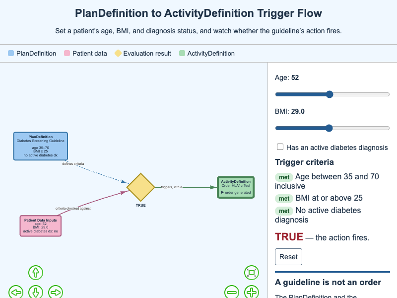PlanDefinition to ActivityDefinition Trigger FlowSet a patient's age, BMI, and diagnosis status and watch a FHIR PlanDefinition's criteria decide whether its ActivityDefinition fires.</a>
  <a href="post-surgical-care-transition-workflow/" title="Post-Surgical Care Transition Workflow" style="display:block;border:1px solid #e3e7ec;border-radius:8px;overflow:hidden;text-decoration:none;color:inherit;box-shadow:0 1px 3px rgba(0,0,0,0.08);">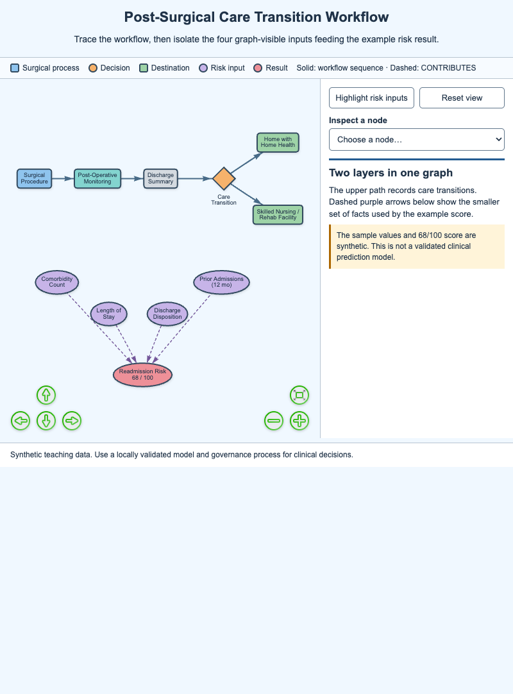Post-Surgical Care Transition WorkflowTrace a surgical care transition and isolate the four graph-visible inputs feeding an illustrative readmission-risk result.</a>
  <a href="predictive-model-performance-traditional-graph-based/" title="Predictive Model Performance: Traditional vs Graph-Based" style="display:block;border:1px solid #e3e7ec;border-radius:8px;overflow:hidden;text-decoration:none;color:inherit;box-shadow:0 1px 3px rgba(0,0,0,0.08);">Predictive Model Performance: Traditional vs Graph-Based</a>
  <a href="presentation-effectiveness-rubric/" title="Presentation Effectiveness Rubric" style="display:block;border:1px solid #e3e7ec;border-radius:8px;overflow:hidden;text-decoration:none;color:inherit;box-shadow:0 1px 3px rgba(0,0,0,0.08);">Presentation Effectiveness Rubric</a>
  <a href="preventive-care-gap-closure/" title="Preventive Care Gap Closure MicroSim" style="display:block;border:1px solid #e3e7ec;border-radius:8px;overflow:hidden;text-decoration:none;color:inherit;box-shadow:0 1px 3px rgba(0,0,0,0.08);">Preventive Care Gap Closure MicroSim</a>
  <a href="prior-authorization-decision-tree-microsim/" title="Prior Authorization Decision Tree Interactive MicroSim" style="display:block;border:1px solid #e3e7ec;border-radius:8px;overflow:hidden;text-decoration:none;color:inherit;box-shadow:0 1px 3px rgba(0,0,0,0.08);">Prior Authorization Decision Tree Interactive MicroSim</a>
  <a href="project-complexity-comparison-table/" title="Project Complexity Comparison Table" style="display:block;border:1px solid #e3e7ec;border-radius:8px;overflow:hidden;text-decoration:none;color:inherit;box-shadow:0 1px 3px rgba(0,0,0,0.08);">Project Complexity Comparison Table</a>
  <a href="provider-capacity-utilization-dashboard-chart/" title="Provider Capacity Utilization Dashboard Chart" style="display:block;border:1px solid #e3e7ec;border-radius:8px;overflow:hidden;text-decoration:none;color:inherit;box-shadow:0 1px 3px rgba(0,0,0,0.08);">Provider Capacity Utilization Dashboard Chart</a>
  <a href="provider-compensation-comparison-chart/" title="Provider Compensation Comparison Chart" style="display:block;border:1px solid #e3e7ec;border-radius:8px;overflow:hidden;text-decoration:none;color:inherit;box-shadow:0 1px 3px rgba(0,0,0,0.08);">Provider Compensation Comparison Chart</a>
  <a href="provider-network-centrality-analysis-dashboard/" title="Provider Network Centrality Analysis Dashboard" style="display:block;border:1px solid #e3e7ec;border-radius:8px;overflow:hidden;text-decoration:none;color:inherit;box-shadow:0 1px 3px rgba(0,0,0,0.08);">Provider Network Centrality Analysis Dashboard</a>
  <a href="provider-network-fraud-detection-dashboard/" title="Provider Network Fraud Detection Dashboard" style="display:block;border:1px solid #e3e7ec;border-radius:8px;overflow:hidden;text-decoration:none;color:inherit;box-shadow:0 1px 3px rgba(0,0,0,0.08);">Provider Network Fraud Detection Dashboard</a>
  <a href="provider-performance-comparison-microsim/" title="Provider Performance Comparison MicroSim" style="display:block;border:1px solid #e3e7ec;border-radius:8px;overflow:hidden;text-decoration:none;color:inherit;box-shadow:0 1px 3px rgba(0,0,0,0.08);">Provider Performance Comparison MicroSim</a>
  <a href="provider-referral-network-analysis-microsim/" title="Provider Referral Network Analysis MicroSim" style="display:block;border:1px solid #e3e7ec;border-radius:8px;overflow:hidden;text-decoration:none;color:inherit;box-shadow:0 1px 3px rgba(0,0,0,0.08);">Provider Referral Network Analysis MicroSim</a>
  <a href="query-optimization-workflow-diagram/" title="Query Optimization Workflow Diagram" style="display:block;border:1px solid #e3e7ec;border-radius:8px;overflow:hidden;text-decoration:none;color:inherit;box-shadow:0 1px 3px rgba(0,0,0,0.08);">Query Optimization Workflow Diagram</a>
  <a href="query-performance-impact-indexing/" title="Query Performance Impact of Indexing" style="display:block;border:1px solid #e3e7ec;border-radius:8px;overflow:hidden;text-decoration:none;color:inherit;box-shadow:0 1px 3px rgba(0,0,0,0.08);">Query Performance Impact of Indexing</a>
  <a href="query-performance-comparison-chart-rdbms-graph/" title="Query Performance: RDBMS vs Graph" style="display:block;border:1px solid #e3e7ec;border-radius:8px;overflow:hidden;text-decoration:none;color:inherit;box-shadow:0 1px 3px rgba(0,0,0,0.08);">Query Performance: RDBMS vs Graph</a>
  <a href="query-performance-comparison/" title="query-performance-comparison" style="display:block;border:1px solid #e3e7ec;border-radius:8px;overflow:hidden;text-decoration:none;color:inherit;box-shadow:0 1px 3px rgba(0,0,0,0.08);">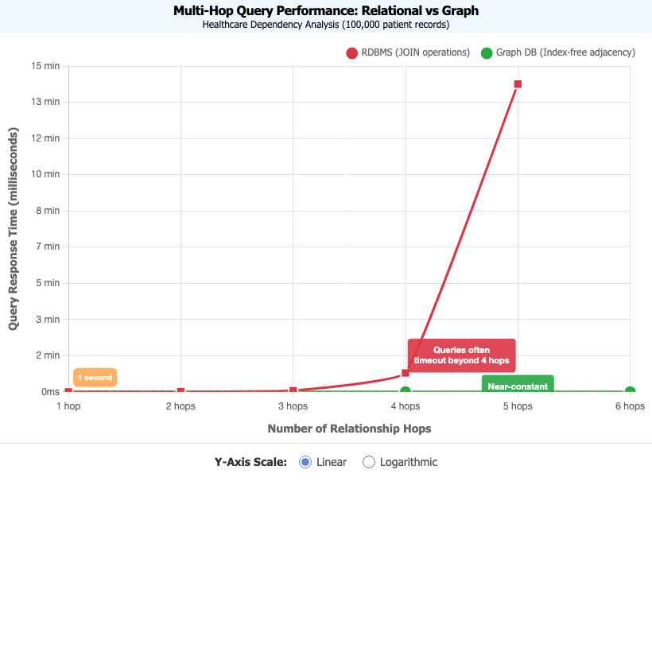query-performance-comparison</a>
  <a href="rag-architecture-clinical-decision-support/" title="RAG Architecture for Clinical Decision Support" style="display:block;border:1px solid #e3e7ec;border-radius:8px;overflow:hidden;text-decoration:none;color:inherit;box-shadow:0 1px 3px rgba(0,0,0,0.08);">RAG Architecture for Clinical Decision Support</a>
  <a href="relational-vs-graph-data-model-comparison/" title="Relational vs. Graph Data Model Side-by-Side" style="display:block;border:1px solid #e3e7ec;border-radius:8px;overflow:hidden;text-decoration:none;color:inherit;box-shadow:0 1px 3px rgba(0,0,0,0.08);">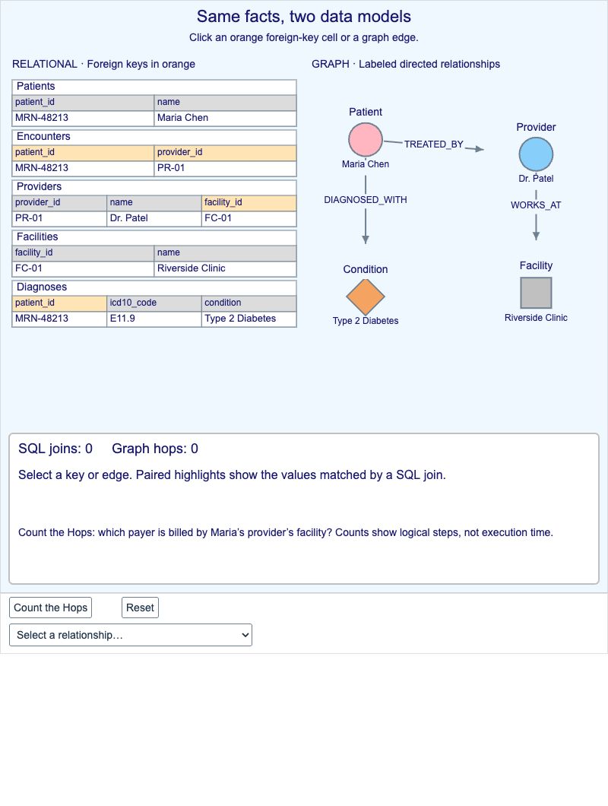Relational vs. Graph Data Model Side-by-SideGiven the same four healthcare facts modeled two ways, the learner can differentiate how a relational schema and a graph data model each represent an identical relationship, and can trace the extra steps the relational version requires.</a>
  <a href="remote-monitoring-data-flow-graph-model/" title="Remote Monitoring Data Flow Graph Model" style="display:block;border:1px solid #e3e7ec;border-radius:8px;overflow:hidden;text-decoration:none;color:inherit;box-shadow:0 1px 3px rgba(0,0,0,0.08);">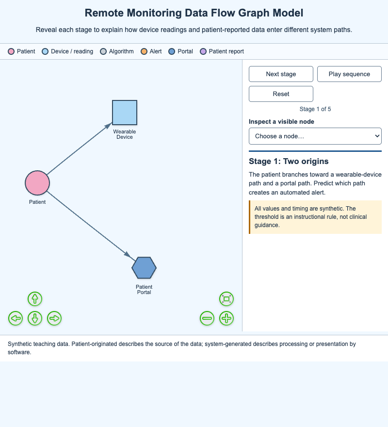Remote Monitoring Data Flow Graph ModelStep through concrete device readings, an illustrative alert rule, a telehealth visit, and a parallel patient-portal path.</a>
  <a href="risk-adjustment-capitation-calculator-microsim/" title="Risk Adjustment and Capitation Calculator MicroSim" style="display:block;border:1px solid #e3e7ec;border-radius:8px;overflow:hidden;text-decoration:none;color:inherit;box-shadow:0 1px 3px rgba(0,0,0,0.08);">Risk Adjustment and Capitation Calculator MicroSim</a>
  <a href="risk-stratification-pyramid-intervention-strategies/" title="Risk Stratification Pyramid with Intervention Strategies" style="display:block;border:1px solid #e3e7ec;border-radius:8px;overflow:hidden;text-decoration:none;color:inherit;box-shadow:0 1px 3px rgba(0,0,0,0.08);">Risk Stratification Pyramid with Intervention Strategies</a>
  <a href="security-incident-response-lifecycle/" title="Security Incident Response Lifecycle" style="display:block;border:1px solid #e3e7ec;border-radius:8px;overflow:hidden;text-decoration:none;color:inherit;box-shadow:0 1px 3px rgba(0,0,0,0.08);">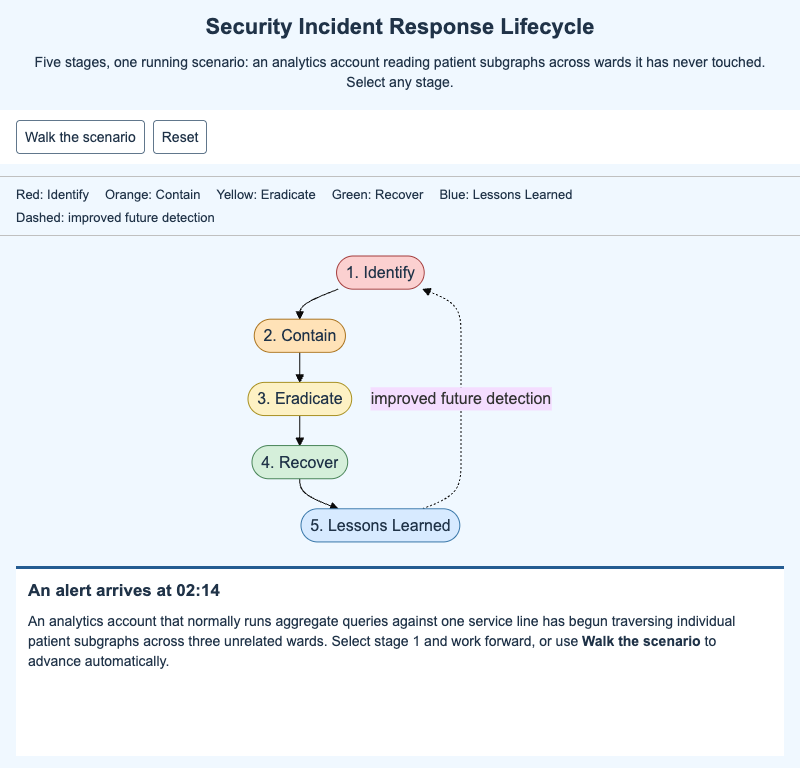Security Incident Response LifecycleSequence the five incident response stages against a running insider-threat scenario in a healthcare graph database.</a>
  <a href="service-line-profitability-analysis-microsim/" title="Service Line Profitability Analysis Interactive MicroSim" style="display:block;border:1px solid #e3e7ec;border-radius:8px;overflow:hidden;text-decoration:none;color:inherit;box-shadow:0 1px 3px rgba(0,0,0,0.08);">Service Line Profitability Analysis Interactive MicroSim</a>
  <a href="symptom-disease-diagnostic-network/" title="Symptom-Disease Diagnostic Network" style="display:block;border:1px solid #e3e7ec;border-radius:8px;overflow:hidden;text-decoration:none;color:inherit;box-shadow:0 1px 3px rgba(0,0,0,0.08);">Symptom-Disease Diagnostic Network</a>
  <a href="value-based-payment-shared-savings/" title="Value-Based Payment Shared-Savings MicroSim" style="display:block;border:1px solid #e3e7ec;border-radius:8px;overflow:hidden;text-decoration:none;color:inherit;box-shadow:0 1px 3px rgba(0,0,0,0.08);">Value-Based Payment Shared-Savings MicroSim</a>
  <a href="vector-embedding-similarity-visualization-microsim/" title="Vector Embedding Similarity Visualization MicroSim" style="display:block;border:1px solid #e3e7ec;border-radius:8px;overflow:hidden;text-decoration:none;color:inherit;box-shadow:0 1px 3px rgba(0,0,0,0.08);">Vector Embedding Similarity Visualization MicroSim</a>
  <a href="view-hc-icons/" title="View Healthcare Icons" style="display:block;border:1px solid #e3e7ec;border-radius:8px;overflow:hidden;text-decoration:none;color:inherit;box-shadow:0 1px 3px rgba(0,0,0,0.08);">View Healthcare Icons</a>
  <a href="vital-signs-trend-visualization-microsim/" title="Vital Signs Trend Visualization MicroSim" style="display:block;border:1px solid #e3e7ec;border-radius:8px;overflow:hidden;text-decoration:none;color:inherit;box-shadow:0 1px 3px rgba(0,0,0,0.08);">Vital Signs Trend Visualization MicroSim</a>
  <a href="yin-yang-llm-kg/" title="Yin-Yang LLM vs Knowledge Graph" style="display:block;border:1px solid #e3e7ec;border-radius:8px;overflow:hidden;text-decoration:none;color:inherit;box-shadow:0 1px 3px rgba(0,0,0,0.08);">Yin-Yang LLM vs Knowledge Graph</a>

